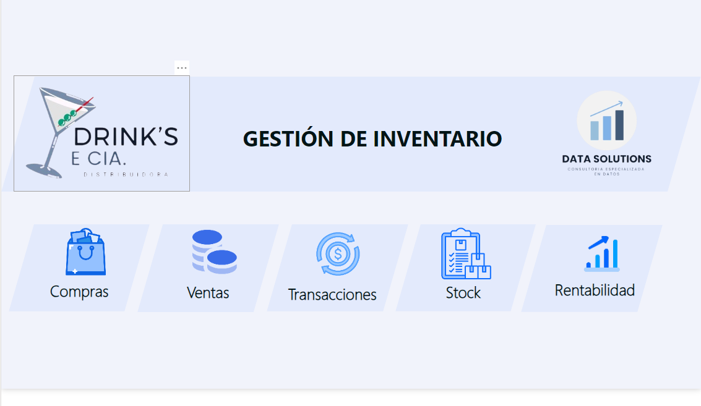
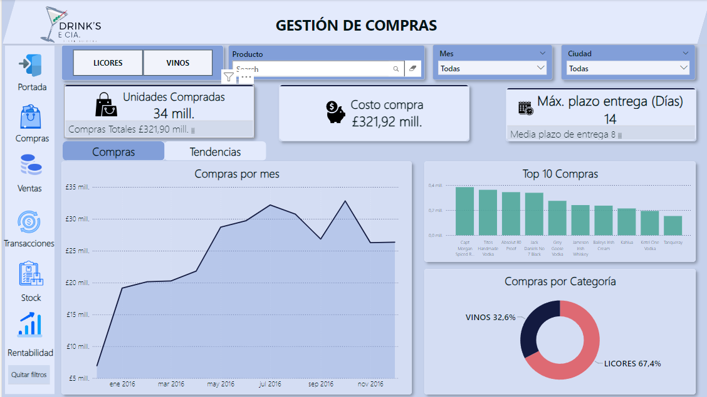
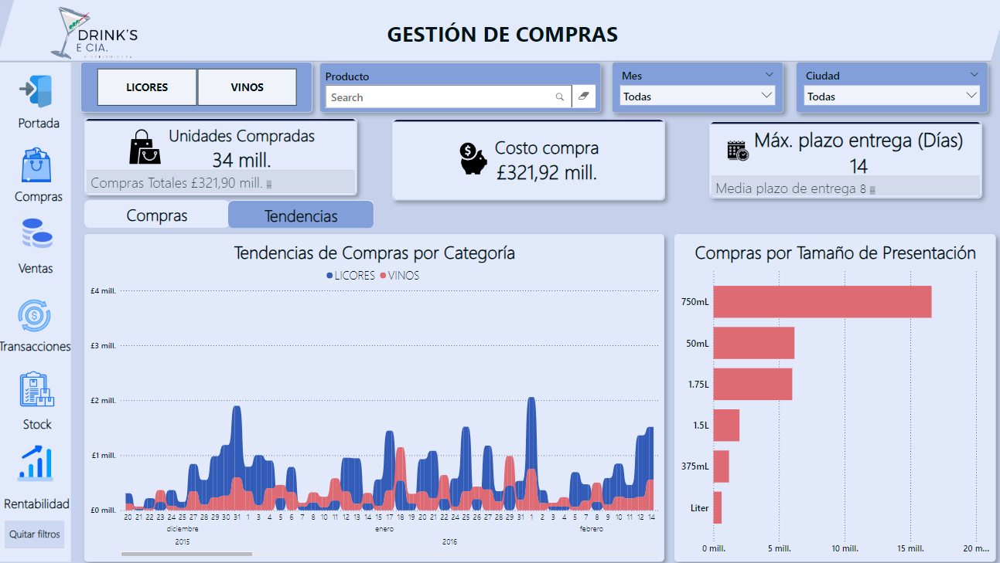
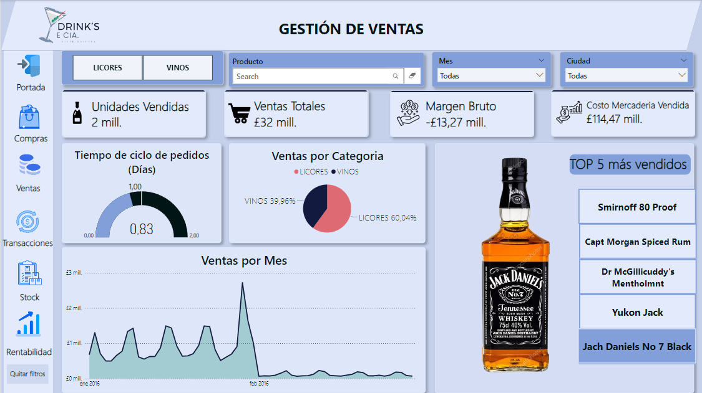
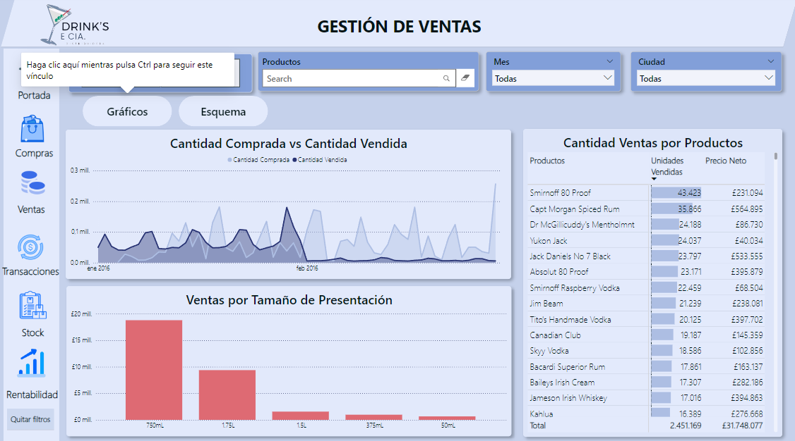
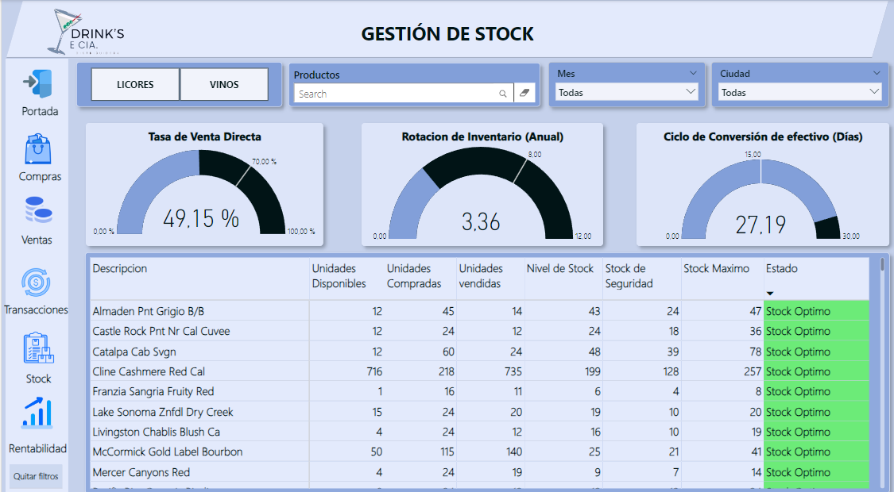
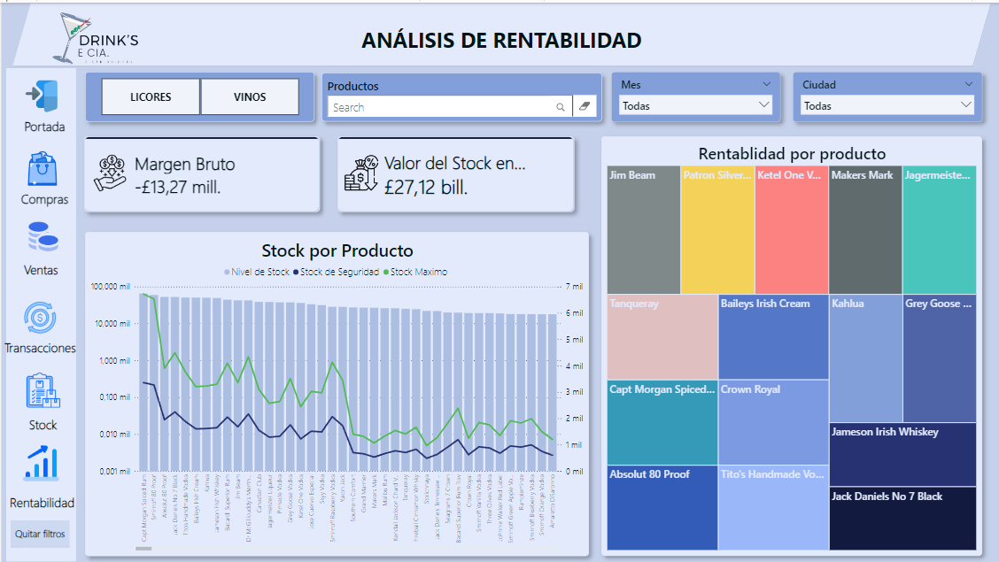

## Análisis del dashboard

#### Luego de implementar todas las medidas, logramos armar con éxito el tablero final con gráficos que ayudan a dar respuesta a las necesidades planteadas por DRINK´S CIA.Este panel proporciona una visualización completa de los datos, lo que permite a DRINK´S CIA tomar decisiones informadas sobre como llevar adelante de forma óptima la gestión de su inventario.

#### El dashboard se divide de la siguiente manera:
### Portada 📊

##### En la portada nos vamos a encontrar con cinco botones que nos ayudan a navegar por las páginas del tablero.

### Compras 🛍️

#### En esta página, el usuario puede consultar de un vistazo una descripción general completa de la información más relevante sobre las compras. Los datos se pueden filtrar por categorias, productos, meses y ciudades, lo que proporciona una visualización personalizada de como se distribuyen las compras.
* **Las tarjetas superiores resaltan los indicadores claves de las compras, proporcionando una descripción rápida de la situación.**
* **El gráfico de líneas muestra como se desenvuelven las ventas a los largo del tiempo .**
* **Un segundo gráfico de columnas que proporciona información sobre los productos que mas se compra .**
* **A la izquierda del tablero se encuentra los botones para navegar entre las páginas.**
* **El último gráfico de donut chart (gráfico de rosquilla) que muestra la distribución proporcional de las compras entre estas dos categorías.**

### Siguiendo con el análisis de compras en una segunda sección tenemos las Tendencias:

* **El gráfico de áreas apiladas explica las tendencias de compras por categoría para dos tipos de productos: licores y vinos. Es relevante porque permite visualizar cómo varían las compras de estos productos a lo largo del tiempo, en este caso, entre diciembre de 2015 y febrero de 2016.**
* **El segundo gráfico de barras  ilustra las cantidades de compras según diferentes tamaños de presentación.
Los tamaños incluyen 750 ml, 1L, 1.75L.**

### Ventas 💰

#### En esta sección profundizamos en los datos específicos de las ventas, proporcionando una descripción más detallada de la situación.
* **En la parte superior encontramos con los filtros por categoría, por productos donde se puede escribir y buscar el producto interesado, también se puede filtrar meses y ciudades.**
* **Abajo de los filtros se encuentran los KPI´S  mas importantes.**
* **Un tacometro de tiempo de ciclo de pedidos que es crucial para evaluar la eficiencia del proceso de adquisición y entrega de productos.**
* **Un gráfico de torta que proporciona una visión rápida de cómo se comparan las ventas entre estas dos categorías.**
* **Como tercer gráfico, encontramos el de áreas que muestra la distribución de las ventas en el periodo seleccionado.**
* **A la izquierda del tablero se encuentra los botones para navegar entre las páginas.**
* **En el margen derecho se puede observar marcadores con los nombres de los producto mas vendidos,donde se puede hacer clic y la imagen del producto va cambiando.**

### Transacciones⌛

#### Esta página proporciona una descripción detallada de los movimientos de la empresa.

* **Al igual de las páginas enteriores en la parte superior podemos encontrar los filtros.**
* **A la izquierda del tablero se eencuentra los botones para navegarentre las páginas.**
* **En la sección gráficos podemos ver un gráfico de áreas, donde se puede observar como las cantidades fluctuan a lo largo del tiempo.**
* **Un segundo gráfico de barras que muestra las medidas que mas se venden.**
* **Por último una tabla que describe cada producto, las unidades vendidas y el precio.**
* **En la sección de "esquema" podemos observar un esquema jerarquico, que va mostrando las ventas según la clasificación y los productos.**

### Stock📋
#### La página de "Stock" proporciona una visión integral del estado actual del inventario.

* **En la parte superior se traen los mismo filtros que las páginas anteriores.**
* **Luego se encuentran los tacometros como principales KPI´S: Tasa de venta de directa ( expresa el porcentaje de inventario vendido en comparación con la cantidad de inventario recibido del fabricante o proveedor ), Rotación de Inventario (Mide la eficiencia con la que se vende el inventario), Ciclo de conversión de efectivo (Es el tiempo en que el dinero vuelve a ser dinero ).**
* **A la izquierda del tablero se encuentra los botones para navegar entre las páginas.**
* **Por último una matriz, que describe en que estado se encuentran cada unos de los productos.**

### Rentabilidad 📈
#### La página de "Rentabilidad" ofrece una visión detallada del desempeño financiero de la empresa.

* **En la parte superior se pueden aplicar filtros por categorías, productos, meses y ciudades.**
* **Encontramos tarjetas KPI´S, indicaroes de rentabilidad: margen bruto y valor del stock.**
* **Un gráfico de columnas agrupadas y de líneas que muestra en que nivel esta el stock en comparacion con el stock de seguridad y el stock máximo.**
* **A la izquierda del tablero se encuentra los botones para navegar entre las páginas.**
* **Finalmente un streemap que indica cuales son los productos mas rentables ( top 15 productos).**

### Conclusión 🚨
#### Una gestión de inventario eficaz es vital para el éxito de cualquier empresa. Al analizar los datos y optimizar las prácticas de inventario, se pueden lograr importantes beneficios, como la reducción de costos, la mejora en la rotación de productos, la eficiencia en la cadena de suministro y, en última instancia, un impacto positivo en la rentabilidad y la satisfacción del cliente. Las decisiones informadas basadas en datos permiten a la empresa mantenerse competitiva y adaptable en un mercado dinámico.

### Muchas gracias por confiar en el equipo de DATA SOLUTIONS:
                    

